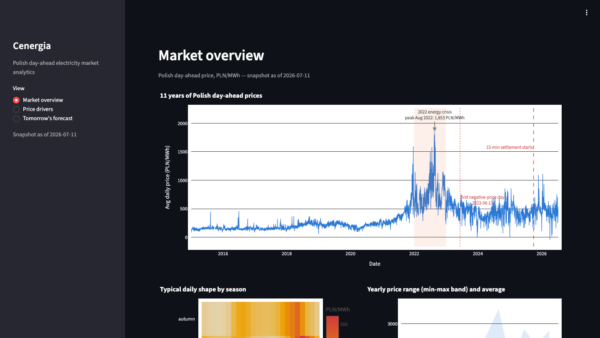

# Cenergia

**Analytics and day-ahead price forecasting for the Polish electricity market — built on open data.**

[](https://github.com/mstudniarski-arch/cenergia/actions)

<!-- The CI badge resolves once this repo is pushed to GitHub (currently local/private). -->

An end-to-end data project on real Polish power-market data: four public APIs → a DuckDB
warehouse → a leakage-guarded feature matrix → an honestly evaluated day-ahead price
forecaster → three narrative notebooks and a live Streamlit dashboard. 101,014 hourly
prices from 2015 to now; 96 tests; `mypy --strict`.

**Live demo → https://cenergia-mski.fly.dev** &nbsp;(scale-to-zero on Fly; the first
request cold-starts the machine and takes ~6 s — it isn't broken, it's waking up. Page 3
computes a real next-day forecast at request time.)



---

## Five findings

Every number below is computed live from the warehouse or the committed backtest — nothing
is hand-typed. Sources in parentheses.

1. **The 2022 energy crisis was an 8× shock.** August 2022 averaged **1,270 PLN/MWh** —
   **8.1× the calm 156 PLN/MWh baseline** of 2015–2017. (notebook 01)
2. **The merit-order effect, isolated and quantified.** Holding load fixed, each
   **+10 percentage points of renewable share cuts the price by ~85.2 PLN/MWh**
   (95% CI −89.9 to −80.5), from an OLS regression with HAC/Newey-West standard errors at
   a 168-hour lag window. (notebook 02)
3. **Negative prices went from nonexistent to routine.** The first negative-price hour was
   **2023-06-11**; by **2024 there were 197** such hours and **310 in 2025**. The same
   renewables build-out widened the midday-vs-evening duck-curve spread from −9 PLN/MWh in
   2015 to +376 PLN/MWh in 2025. (notebook 01)
4. **The forecaster beats a strong baseline by ~28%.** Over a 6-month walk-forward
   backtest the LightGBM model scores **rMAE 0.722** (MAE 92.90 PLN/MWh, RMSE 149.43) —
   a **~28% MAE reduction** against a same-hour-yesterday naive forecast (MAE 128.6), and
   it wins in 5 of the 6 test months. (`results/backtest.csv`)
5. **The hardest hours are the renewable transitions.** Error is flat and low overnight
   (MAE 56–70) but peaks twice in the day: **midday** (12–14h, MAE 128–137), when solar
   output and its forecast error are largest, and the **evening ramp** (19–20h), when
   solar fades while demand holds and the merit order swings hard toward expensive plant.
   (notebook 03)

The one honest exception: February 2026 is the model's only month with rMAE > 1 (1.328).
Notebook 03 shows this is **not** model degradation — lgbm's Feb MAE (95.2) sits inside its
usual 87–101 band — but a naive baseline that had an unusually easy month (its MAE cratered
to 71.7). rMAE is a ratio; a collapsing denominator pushes it above 1 on its own. Checking
rMAE alongside the raw MAE it is built from, never instead of it, is the point.

## What this demonstrates

| Skill | Where |
|---|---|
| Data acquisition from real APIs | `src/cenergia/ingest/` — four keyless clients (PSE, Ember, Open-Meteo, NBP), each with recorded-fixture tests for its documented quirks (DST rows, comma-decimal values, unit conversions) |
| SQL transformation | `sql/` — staging + marts as plain ordered `.sql` on DuckDB, tested against in-memory fixtures |
| Statistical inference | `notebooks/02` — merit-order effect via OLS with HAC standard errors; Spearman correlations; explicit reasoning about autocorrelation and confounds |
| Exploratory analysis | `notebooks/01` — eleven years, three regimes; distributions, ACF/PACF, duck-curve and negative-price quantification |
| Feature engineering without leakage | `src/cenergia/features/matrix.py` + `tests/unit/features/test_leakage.py` — an availability-cutoff rule enforced by a pytest, not just a comment |
| ML evaluation | `src/cenergia/models/backtest.py` + `results/backtest.csv` — walk-forward with honest baselines and a skill metric (rMAE), plus a worst-days error anatomy |
| Software engineering | `.github/workflows/ci.yml` — 96 tests, `ruff`, `mypy --strict`, all green in CI |
| Communication | three narrative notebooks, this README, and a live dashboard |
| Deployment | `Dockerfile.fly` + `fly.toml` — Streamlit on Fly.io, scale-to-zero, snapshot bundled in the image |

## Architecture

```
ingest (Python clients, tested)          warehouse (DuckDB, single file)
  ember.py    ─┐                           raw.*      source-shaped tables
  nbp.py      ─┼─► data/raw/* ──loader──►  staging.*  cleaned, UTC, hourly   ──► marts.*
  pse.py      ─┤                          (plain ordered SQL in sql/,             modeling table
  openmeteo.py─┘                           run by a ~15-line Python runner)        + dashboard views
                                                                                       │
      notebooks/ (01-eda · 02-drivers · 03-forecasting) ◄─────────────────────────────┤
      models/   (naive · seasonal-naive · LightGBM, walk-forward) ──► results/ + artifact
      dashboard/ (Streamlit on Fly, runtime-live forecast + snapshot fallback) ◄───────┘
```

| Source | What | Range | License / attribution |
|---|---|---|---|
| **Ember** | Hourly PL day-ahead price (EUR/MWh), converted to PLN via NBP | 2015 → near-present | CC-BY-4.0 |
| **PSE API** | 15-min day-ahead price (PLN/MWh), load actual+forecast, generation by fuel, wind/PV | 2024-06-14 → now | Free, no key |
| **Open-Meteo** | Hourly weather (temperature, wind@100m, radiation, cloud) — archive + forecast | archive: decades; forecast: +16 d | CC-BY-4.0 |
| **NBP API** | Daily EUR/PLN mid rate (table A) | 2015 → now | Free, no key |

Ember powers the eleven-year analyst-side history (a cross-source QA check finds Ember and
PSE agree at r = 0.99999 over 18,166 overlapping hours). The **model trains only on the
PSE era** (2024-06 → now), where the full covariate set exists.

*Attributions required by the source licenses:* electricity price data from
[Ember](https://ember-energy.org/) (CC-BY-4.0); weather data from
[Open-Meteo](https://open-meteo.com/) (CC-BY-4.0); market data from
[PSE](https://www.pse.pl/); FX rates from [NBP](https://nbp.pl/).

## The forecasting problem

- **Target:** the next day's (D+1) 24 hourly CSDAC prices in PLN/MWh.
- **Cutoff rule (leakage guard):** every input must be known before the 12:00 CET auction
  gate on day D — so only price lags ≥ 24 h, PSE's own D+1 load forecast, Open-Meteo's D+1
  weather forecast, and the calendar. This is asserted by a pytest that checks each
  feature's availability timestamp, not left to a comment.
- **Honest metric:** rMAE (skill versus the naive baseline). MAPE is rejected outright
  because Polish prices cross zero — over 5% of the backtest window is negative.
- **Headline:** LightGBM scores **rMAE 0.722** across the 6-month walk-forward — ~28% below
  a same-hour-yesterday guess, winning in 5 of 6 months.
- **The catch:** the backtest evaluates on Open-Meteo *reanalysis* (the weather that
  happened), so it does not yet see live-forecast weather error — see limitations.

## Run it yourself

The fastest look is the **[live demo](https://cenergia-mski.fly.dev)**. To run locally
(Python 3.13 + [uv](https://docs.astral.sh/uv/)):

```bash
uv sync --all-groups          # install everything, including dev + notebook deps
make dashboard                 # runs off the committed snapshot marts + model artifact
```

To rebuild the pipeline end to end from the sources:

```bash
make ingest transform validate backtest
```

`make ingest` pulls from the live PSE / Open-Meteo / NBP APIs (all keyless).
Ember's history CSV is **committed** (`data/ember_pl_hourly.csv`) — a fresh Ember download
is only needed to *extend* the history and must be done manually in a browser (the site
403s non-browser fetchers). `make validate` runs the data-quality checks; `make backtest`
reproduces `results/backtest.csv` (a few minutes). `make lint && make test` is the full
CI gate locally.

## Repo tour

- **`src/cenergia/`** — the pipeline: `ingest/` clients, `warehouse/` loader + SQL runner, `features/` matrix builder, `models/` baselines + LightGBM + backtest, `dashboard/` Streamlit app.
- **`sql/`** — staging and marts transformations, plain ordered `.sql`.
- **`notebooks/`** — three narrative notebooks: `01` market EDA, `02` price drivers, `03` forecasting.
- **`data/`** — committed: Ember slice, model artifact, snapshot marts. Gitignored: `warehouse.duckdb`, `raw/`.
- **`results/`** — committed backtest outputs: `backtest.csv`, per-hour CSV, predictions parquet.
- **`tests/`** — 96 unit + integration tests (ingest quirks, SQL outputs, leakage guard, backtest correctness, dashboard smoke).
- **`docs/adr/`** — architecture decision records (see below).

## Known limitations

Straight from notebook 03's error analysis — these are the real gaps, stated plainly:

1. **Train/serve weather skew.** Training features use Open-Meteo's Archive API (ERA5
   reanalysis — the weather that actually happened); a live forecast uses the Forecast API,
   a real prediction with its own error, worst for wind and solar. The fix is Open-Meteo's
   Historical Forecast API, which reconstructs what each past forecast actually said.
2. **~2 years of covariate history.** Load and weather only reach back to 2024-06-14 —
   under two full winters, so the model has seen exactly one cold-snap-plus-wind-lull event
   like the one dissected in notebook 03, not a distribution of them.
3. **No probabilistic intervals.** Every number is a point forecast; the spike and plunge
   days are exactly where a wide interval is most needed. Quantile LightGBM is the natural
   next step.
4. **No cross-border flow features.** PSE's physical-flow entities only have data from 2026
   onward — too short a history to backtest a feature on yet.
5. **The backtest window never spans the settlement break.** All six test months are after
   the 2025-10-01 15-minute settlement switch, so the switch's effect on *model*
   performance (as opposed to raw forecastability) is untested.

## Design decisions

Each deliberate omission has a short ADR in [`docs/adr/`](docs/adr/) — the reasoning, and
the real downside, for every "we didn't use X":

- [0001](docs/adr/0001-duckdb-over-postgres.md) — DuckDB over Postgres
- [0002](docs/adr/0002-plain-sql-over-dbt.md) — plain ordered SQL over dbt
- [0003](docs/adr/0003-lightgbm-ceiling-no-mlflow.md) — LightGBM ceiling, a committed CSV over MLflow
- [0004](docs/adr/0004-runtime-live-over-cron.md) — runtime-live forecast over a cron job
